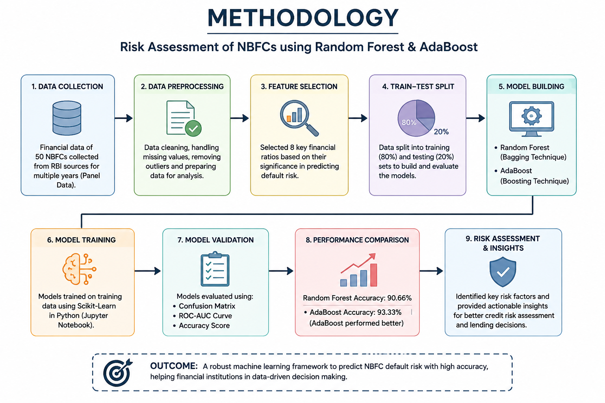
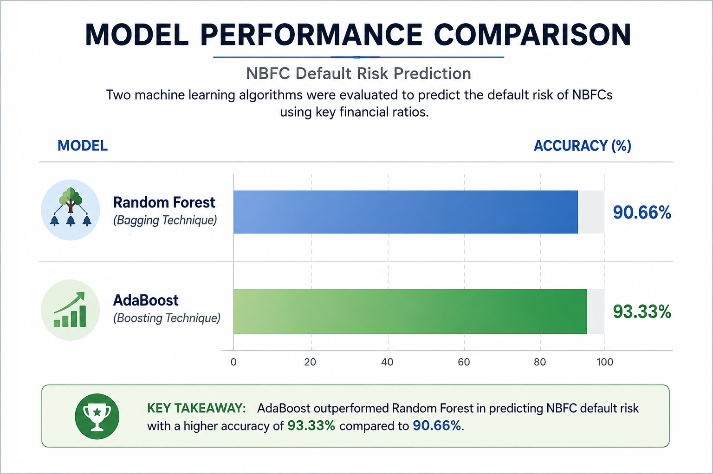
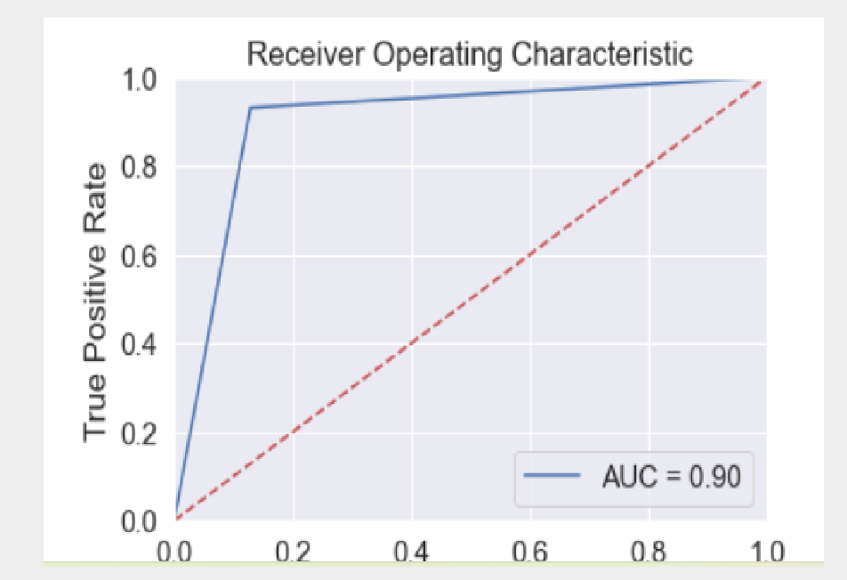
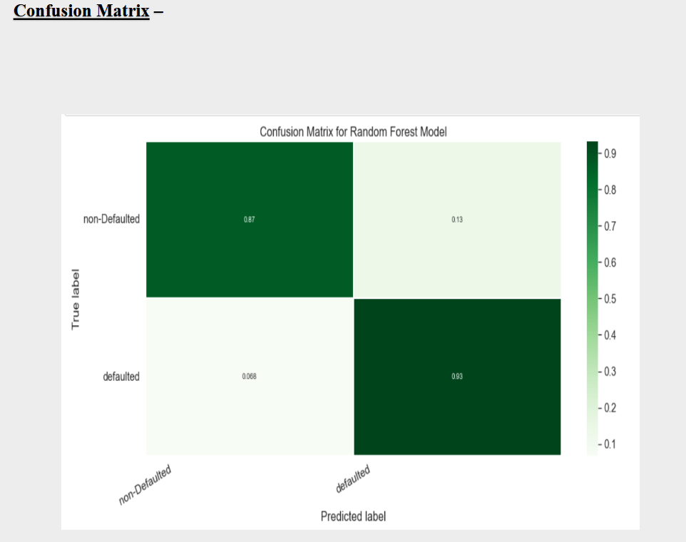
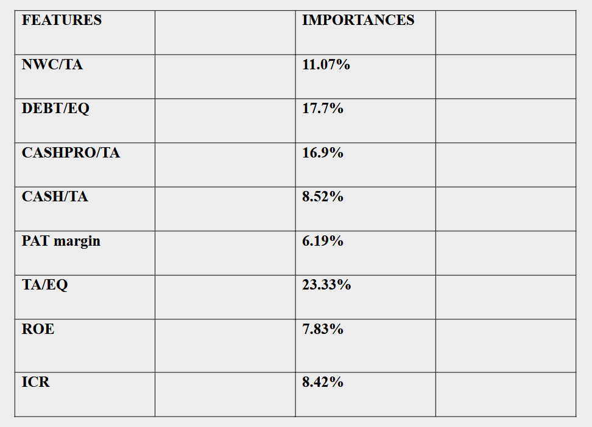

# Risk Assessment of NBFCs using Random Forest & AdaBoost

## 📌 Project Overview

This project focuses on predicting the default risk of Non-Banking Financial Companies (NBFCs) using Machine Learning techniques. The objective was to identify key financial indicators influencing default risk and evaluate predictive models that can support lending and credit risk decisions.

---

## 🎯 Business Objective

* Predict potential NBFC defaults using financial ratios.
* Compare the performance of Random Forest and AdaBoost algorithms.
* Identify key risk indicators affecting default probability.
* Support data-driven credit risk assessment.

---

## 🛠️ Tools & Technologies

* Python
* Pandas
* NumPy
* Scikit-Learn
* Matplotlib
* Seaborn
* Jupyter Notebook

---

## 📊 Methodology



The project followed a structured machine learning workflow involving data preprocessing, feature selection, model development, evaluation, and risk assessment.

---

## 🤖 Machine Learning Models

### Random Forest

* Accuracy: **90.66%**

### AdaBoost

* Accuracy: **93.33%**

---

## 📈 Results Comparison



AdaBoost achieved higher predictive accuracy compared to Random Forest and demonstrated better classification performance.

---

## 📉 ROC Curve



---

## 📊 Confusion Matrix



---

## 🔍 Feature Importance



Key financial ratios such as Debt-to-Equity Ratio, Return on Equity (ROE), Interest Coverage Ratio, and Total Assets-to-Equity Ratio significantly influenced model predictions.

---

## 💡 Key Findings

* AdaBoost outperformed Random Forest in classification accuracy.
* Financial leverage and profitability ratios were strong predictors of default risk.
* Machine learning can effectively support NBFC credit risk assessment.
* Predictive analytics can assist financial institutions in proactive risk management.

---

## 📂 Repository Structure

```text
NBFC-Risk-Assessment-Using-Machine-Learning
│
├── images/
├── README.md
├── requirements.txt
└── PROJECT_REPORT.pdf
```

## 📄 Project Report

The complete MBA project report is included in this repository for reference and academic purposes.

---

## 👩‍💻 Author

**Gauravi Thakur**

MBA (Analytics & Data Science)

Machine Learning | Risk Analytics | Data Analytics | Python
